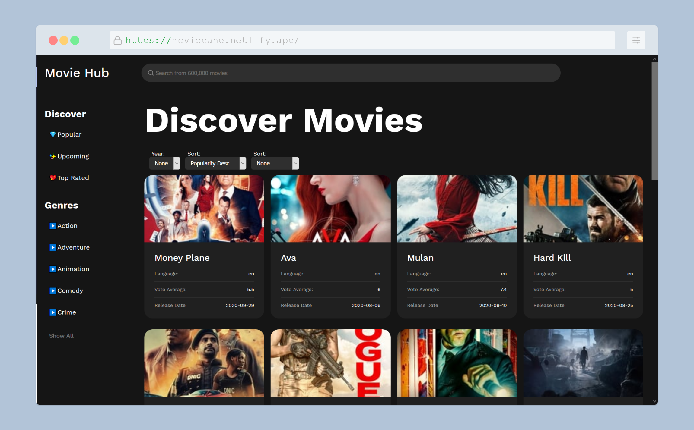

# Movie Library w/ ReactJS

## [Check it live here](https://moviepahe.netlify.app/)



A Movie Library made with ReactJS using The Movie Database API


### Installing

Clone the Repository and run

```
npm install
npm run dev
```

## Deployment

To deploy simply run

```
npm run build
```

## Built With

- [React JS](https://reactjs.org/)
- [React Router](https://github.com/ReactTraining/react-router)
- [Redux](https://redux.js.org/)
- [Redux Saga](https://github.com/reduxjs/redux-thunk)
- [Styled Components](https://www.styled-components.com)


